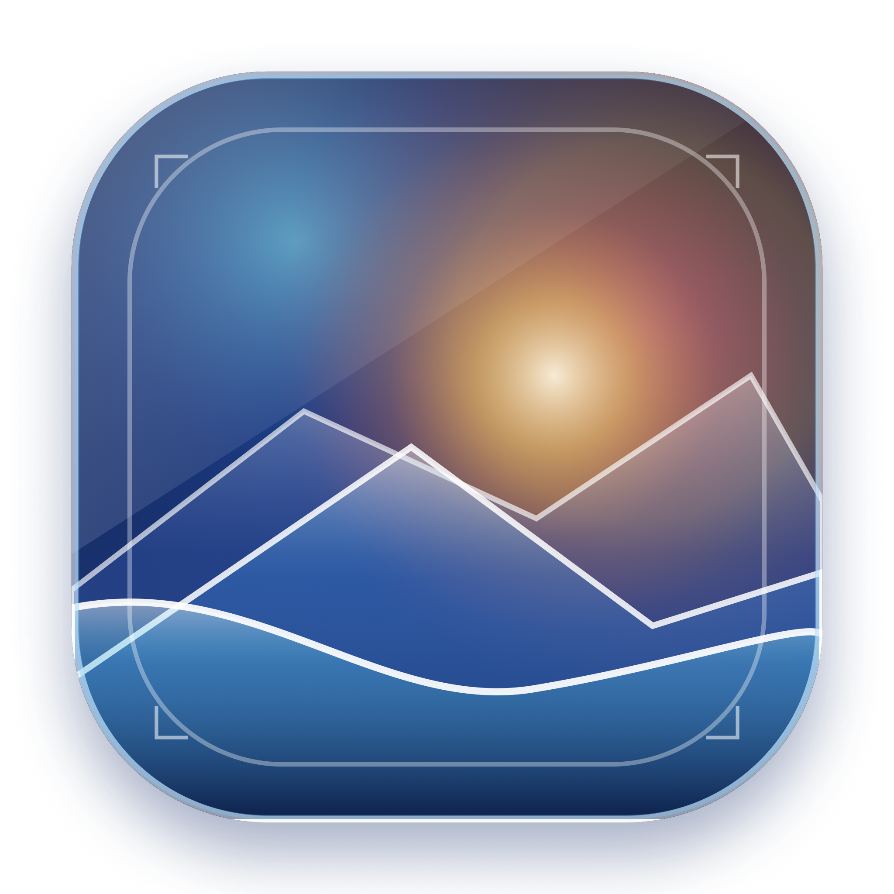
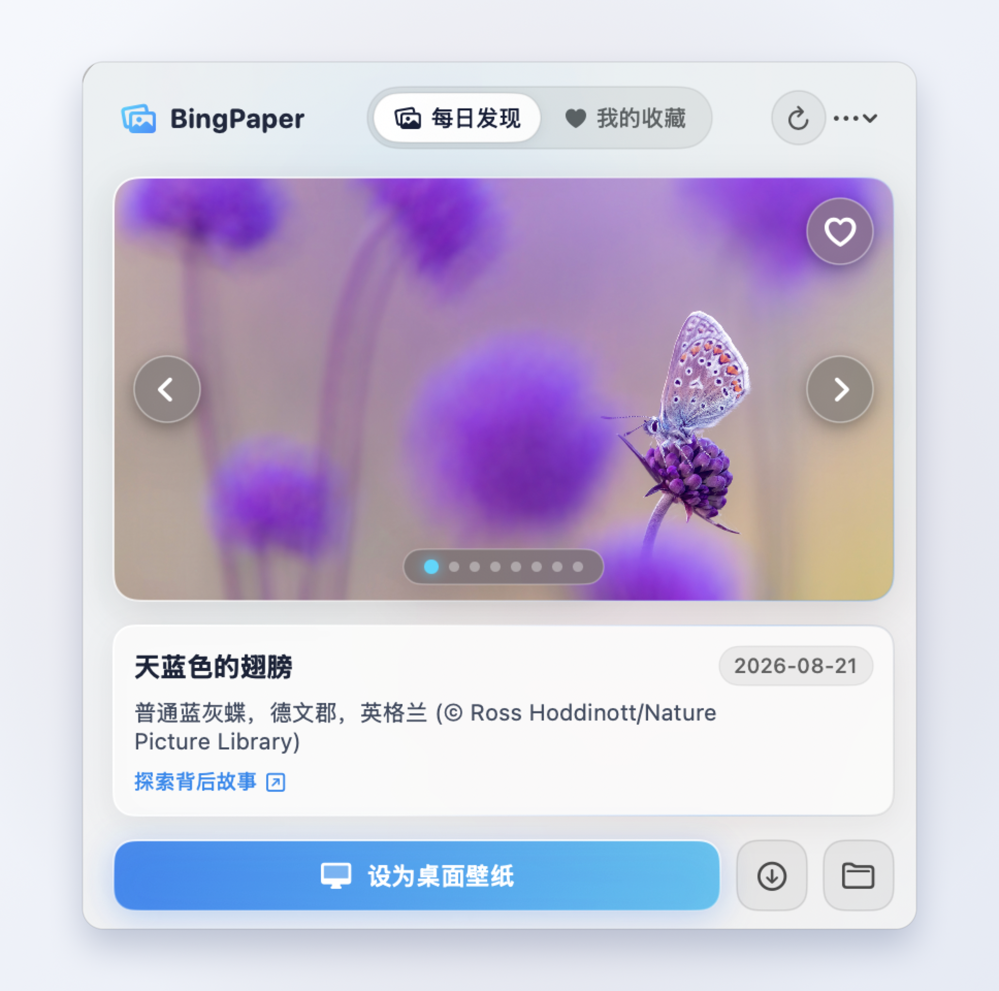
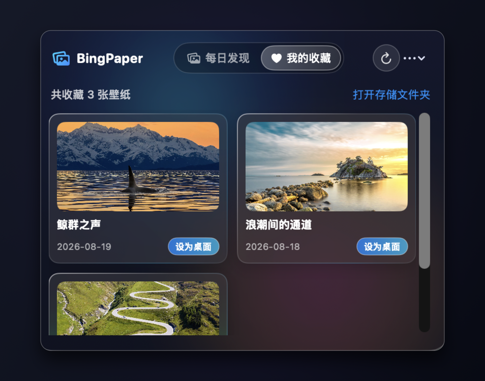

<div align="center">



# 🌄 BingPaper (必应壁纸 for Mac)

**每日发现世界之美 · 专为 macOS 打造的原生液态毛玻璃必应壁纸应用**

[](https://swift.org)
[](https://apple.com/macos)
[](LICENSE)
[](#)

<p align="center">
  <a href="#-核心亮点">核心亮点</a> •
  <a href="#-应用截图">界面预览</a> •
  <a href="#-快速开始">快速安装</a> •
  <a href="#-快捷操作">操作指南</a> •
  <a href="#-技术架构">技术架构</a>
</p>

</div>

---

## 📸 界面预览

<div align="center">

| ☀️ 浅色模式 · 每日发现 (4K超清浏览) | 🌙 深色模式 · 我的收藏 (液态毛玻璃) |
| :---: | :---: |
|  |  |

</div>

---

## ✨ 核心亮点

- 🌄 **每日发现 · 4K 原图直达**  
  直连微软 Bing 官方每日壁纸接口，智能优先加载 **4K UHD 超高清画质**，附带每日精美标题、摄影地点与深入探索的背后故事。
- ⏪ **历史回溯 · 8天轮播翻页**  
  支持快捷切换查看最近 8 天历史壁纸，绝不错过任何一张精彩风光。
- ❤️ **壁纸收藏 · 永久离线防丢失**  
  一键收藏心动壁纸，自动持久化存储至本地，即便超过 Bing 官方 8 天窗口期也能在「我的收藏」面板中随时回看。
- 🔮 **macOS 26 级液态毛玻璃视觉 (Liquid Glass)**  
  采用纯原生 `NSVisualEffectView` 深度毛玻璃容器，融合呼吸流动的**极光透光光斑**与镜面高光倒角，完美自适应 macOS 系统深色/浅色模式切换。
- 🖥️ **一键设为桌面壁纸**  
  调用 macOS 原生 `NSWorkspace` 接口，自动下载并一键设置为当前桌面壁纸（完美支持多显示器）。
- 🍃 **轻量常驻 · 极简不打扰**  
  100% 原生 Swift 6 + SwiftUI 构建，常驻顶部状态栏，不占用 Dock 栏，内存与 CPU 占用极低。
- 🖱️ **贴心右键菜单**  
  左键轻点展开卡片面板，右键状态栏图标即可弹出快捷菜单快速退出或打开保存目录。

---

## 🚀 快速开始

### 方式一：直接运行已编译的 App Bundle
```bash
# 启动应用程序
open build/BingPaper.app
```
> **提示**：可直接将 `build/BingPaper.app` 拖入系统的 `/Applications`（应用程序）目录中。

---

### 方式二：从源码一键构建
确保本地已安装 Xcode 命令行工具（Swift 5.9+ / Swift 6）：

```bash
# 1. 克隆本仓库
git clone https://github.com/jijianfeng/BingPaper.git
cd BingPaper

# 2. 执行一键打包脚本
./build_app.sh

# 3. 运行生成好的应用程序
open build/BingPaper.app
```

---

## ⌨️ 快捷操作指南

| 交互动作 | 功能说明 |
| :--- | :--- |
| **状态栏图标 · 左键点击** | 弹出 / 收起主视觉毛玻璃交互面板 |
| **状态栏图标 · 右键点击** | 弹出原生系统上下文快捷菜单（刷新、打开目录、一键退出） |
| **卡片悬浮 · 左右箭头** | 前后切换最近 8 天的历史每日壁纸 |
| **卡片悬浮 · ❤️ 心形按钮** | 收藏 / 取消收藏当前壁纸 |
| **主按钮 · 设为桌面壁纸** | 后台自动下载 4K 超清原图并即时切换 Mac 桌面 |
| **下载图标 · 保存原图** | 将原图单独另存至本地 `~/Pictures/BingWallpapers` 目录 |

---

## 🛠️ 技术架构与工程设计

本项目遵循现代 macOS 原生应用开发规范：

```text
BingPaper/
├── Package.swift               # Swift Package 依赖与构建配置
├── build_app.sh                # 一键 Release 编译与 .app 打包脚本
├── generate_icon.swift         # CoreGraphics 自动化高透液态玻璃图标渲染脚本
├── assets/                     # 截图与视觉资源
│   └── screenshots/
└── Sources/
    └── BingPaper/
        ├── App/
        │   ├── BingPaperApp.swift          # 应用生命周期入口
        │   └── StatusBarController.swift   # NSStatusItem / NSPopover / 原生右键菜单托管
        ├── Models/
        │   └── BingImage.swift            # 必应 API 响应与壁纸元数据模型
        ├── Services/
        │   ├── BingAPIService.swift       # 异步并发 API 请求与 4K 图片下载
        │   ├── WallpaperManager.swift     # 本地图片持久化与 NSWorkspace 桌面设置
        │   └── FavoriteManager.swift      # 收藏夹 JSON 持久化管理
        ├── ViewModels/
        │   └── WallpaperViewModel.swift   # @MainActor 响应式状态管理
        └── Views/
            ├── MenuBarContentView.swift   # 顶部导航与主交互弹窗
            ├── GlassComponents.swift      # 液态毛玻璃修饰器与极光动态背景
            ├── DailyWallpaperCard.swift   # 每日发现大卡片视图
            └── FavoritesGridView.swift    # 我的收藏瀑布流图库视图
```

---

## 📄 开源许可证

本项目基于 [MIT License](LICENSE) 许可证开源，欢迎自由使用、学习与贡献 PR！
